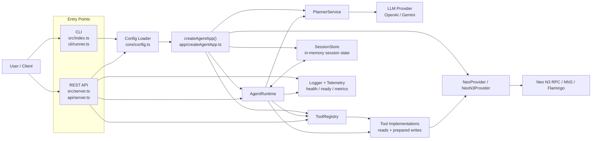

# Neo AI Agent

Neo AI Agent is a CLI-first and server-hostable assistant for Neo N3.

It plans natural-language requests, maps them to Neo N3 tools, and can optionally prepare write actions that require confirmation before broadcast.

## What it does

- fetch Neo N3 GAS, NEO, and tracked NEP-17 balances
- load Neo N3 portfolio overviews
- inspect Neo N3 transfer history
- fetch block and transaction details
- check the status of the most recent transaction in the current session
- invoke read-only Neo N3 contract methods
- prepare Neo N3 contract writes for confirmation
- prepare and confirm Neo N3 GAS transfers
- prepare and confirm Neo N3 NEP-17 transfers
- estimate Flamingo swap routes and quotes
- prepare and confirm Flamingo swaps on Neo N3
- expose the same capabilities through an experimental REST API

## Architecture



Runtime keeps the confirmation boundary for dangerous actions. Planner maps natural-language requests to intents, tool implementations prepare or execute the requested operation, and the Neo provider is the only layer that talks to Neo RPC, NeoNS, and Flamingo contracts.

## Install

```bash
npm install
```

## Run

CLI:

```bash
npm run cli
```

REST API:

```bash
npm run api
```

Build:

```bash
npm run build
```

Verify:

```bash
npm run verify
```

Release verify:

```bash
npm run verify:release
```

## Environment

The agent now uses Neo N3 configuration only.

Required for reads:

- `NEO_N3_RPC_URL` or `NEO_RPC_URL`

Optional for writes:

- `WALLET_WIF`
- `WALLET_PRIVATE_KEY`
- `N3_WALLET_PRIVATE_KEY`

Optional for Flamingo and token overrides:

- `NEO_N3_GAS_TOKEN_CONTRACT`
- `NEO_N3_NNS_CONTRACT`
- `NEO_N3_FLAMINGO_BROKER_CONTRACT`
- `NEO_N3_FLAMINGO_CONVERT_CONTRACT`
- `NEO_N3_FLAMINGO_ROUTER_CONTRACT`
- `NEO_N3_TOKEN_MAP_JSON`
- `NEO_N3_FLAMINGO_PAIRS_JSON`

Optional for the REST API:

- `API_HOST`
- `API_BEARER_TOKEN`
- `PORT`

Optional for LLM planning:

- `LLM_PROVIDER`
- `OPENAI_API_KEY`
- `OPENAI_MODEL`
- `GEMINI_API_KEY`
- `GEMINI_MODEL`

See [.env.example](.env.example) and [.env.testnet.example](.env.testnet.example) for sample configurations.

## Example requests

- `show my portfolio`
- `show all balances`
- `how much GAS do I have on my address`
- `show my last 5 transfers on Neo N3`
- `show my last 3 actions`
- `show transaction 0xabc...`
- `show block 1234567`
- `call balanceOf on 0x1111111111111111111111111111111111111111`
- `send 0.1 GAS to arkadiusz.neo`
- `send 12.5 FUSD to NQ9NEvVrutLL6JDtUMKMrkEG6QpWNxgNBM`
- `what is the best Flamingo route to swap 1 GAS for FUSD`
- `swap 1 GAS for FUSD with force and 1% slippage`

## Confirmation flow

Write tools do not broadcast immediately.

For transfers, swaps, and contract writes, the agent first prepares an unsigned Neo N3 transaction and replies with a summary. The broadcast only happens after an explicit confirmation such as `Confirm`.

`force` changes how the swap route and defaults are selected, but it still does not bypass confirmation.

## REST API

The REST API is experimental.

Useful routes:

- `GET /health`
- `GET /ready`
- `GET /metrics`
- `GET /api/tools`
- `GET /openapi.json`
- `GET /swagger.json`
- `POST /api/messages`
- `POST /api/tools/{toolName}`
- `POST /api/sessions/{sessionId}/confirm`
- `POST /api/sessions/{sessionId}/cancel`

## Notes

- session history is in-memory only
- Neo N3 transfer history depends on the connected RPC capabilities
- Flamingo routing uses the configured Neo N3 token map and pair graph
- the API should be protected with `API_BEARER_TOKEN` when wallet mode is enabled
- REST API responses include `X-Request-Id` for correlation
