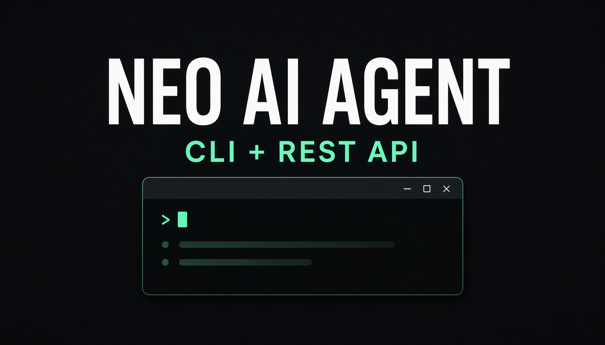

# Neo AI Agent



Neo AI Agent is a Neo assistant that lets you ask for blockchain actions in normal language instead of raw RPC calls or contract tooling.

Technically, it is a CLI-first agent with an experimental REST API. User requests are mapped to Neo N3 and Neo X tools by an optional OpenAI or Gemini planner, with a built-in fallback planner for common prompts when no LLM is configured.

Examples:

- `show portfolio for arkadiusz.neo`
- `how much GAS do I have`
- `show my last 5 transfers`
- `send 0.1 GAS to arkadiusz.neo`
- `swap 1 GAS for FUSD`
- `what is the latest block on Neo X testnet?`
- `check GAS balance of 0x... on Neo X`
- `prepare a GAS transfer on Neo X testnet to 0x...`

> [!IMPORTANT]
> `Neo N3` and `Neo X` are different chains and use different tooling.
> Neo N3 uses Neo addresses, NEP-17 tokens, invocations, and script hashes.
> Neo X is EVM-compatible and uses 0x addresses, JSON-RPC, ABI encoding, and ERC-style contracts.
> Transfers, regular swaps, contract writes, and Neo X transaction previews require confirmation before broadcast.
> A `force` swap is the exception: it skips the separate `Confirm` step, but it still runs the normal wallet, balance, routing, and slippage checks before immediate broadcast.
> `force` exists only for Neo N3 Flamingo swaps. Neo X never uses force.
> See [Force Swaps](#16-force-swaps).

## Table Of Contents

- [Prerequisites](#prerequisites)
- [Two Ways To Use It](#two-ways-to-use-it)
- [What It Can Help With](#what-it-can-help-with)
- [What You Can Ask](#what-you-can-ask)
- [Confirmation And Safety](#confirmation-and-safety)
- [Session Memory](#session-memory)
- [NeoNS Support](#neons-support)
- [Neo X Support](#neo-x-support)
- [Quick Start](#quick-start)
- [Environment Variables](#environment-variables)
- [Security Best Practices](#security-best-practices)
- [REST API](#rest-api)
- [Advanced Configuration](#advanced-configuration)
- [License](#license)

## Prerequisites

Before you start, make sure you have:

- `Node.js 20+`
- `npm` installed
  - the npm version bundled with Node.js 20+ is fine
- a Neo N3 RPC URL
  - for example a mainnet or testnet RPC endpoint
- optionally, Neo X RPC URLs if you want EVM-compatible Neo X support
  - `NEOX_MAINNET_RPC_URL`
  - `NEOX_TESTNET_RPC_URL`
  - or `NEOX_CUSTOM_RPC_URL` with `NEOX_CUSTOM_CHAIN_ID`
- optionally, a wallet secret if you want to prepare transfers or swaps
  - `WALLET_WIF`
  - or `WALLET_PRIVATE_KEY`
  - for Neo X writes, use `NEOX_PRIVATE_KEY`
- optionally, an AI provider key for more flexible natural-language planning
  - `OPENAI_API_KEY`
  - or `GEMINI_API_KEY`

## Two Ways To Use It

You can use this project in two modes:

- `Read-only mode`: no private key loaded. Best for checking balances, transfers, transactions, blocks, and contract reads. In this mode you should usually include a Neo N3 address, NeoNS name, or Neo X 0x address in the prompt.
- `Wallet mode`: load `WALLET_WIF` or `WALLET_PRIVATE_KEY` for Neo N3, and `NEOX_PRIVATE_KEY` for Neo X. Prompts like `show my portfolio` work naturally for Neo N3, and the agent can prepare confirmation-safe write transactions. A Neo N3 `force` swap can also be broadcast immediately.

> [!TIP]
> If you are unsure where to start, start with `read-only` mode.

## What It Can Help With

Neo AI Agent is mainly for everyday Neo N3 tasks:

- check your wallet address
- see your portfolio
- check token balances
- see unclaimed GAS
- inspect transfers, blocks, and transactions
- call read-only smart contract methods
- prepare contract writes
- send GAS
- send NEP-17 tokens
- get Flamingo swap quotes
- prepare and confirm regular Flamingo swaps
- broadcast a `force` Flamingo swap immediately
- track the latest actions from your current session

For Neo X, it can:

- check RPC connectivity, chain ID, and latest block
- check native GAS balances for 0x addresses
- fetch blocks, transactions, and receipts
- call Solidity contracts with ABI fragments
- read ERC-20 metadata and balances
- read ERC-721 owners
- prepare native GAS, ERC-20, and contract-write transaction previews

It is built as a CLI tool first, and it also has an experimental REST API for integrations.

## What You Can Ask

The examples below are intentionally written in plain English because that is the most predictable path, especially when no LLM key is configured.

### 1. Wallet Address

Use this when you want to know which wallet is currently loaded.

Example prompts:

- `show my address`
- `what is my wallet address`
- `show my Neo N3 address`

### 2. Portfolio Overview

Use this when you want one quick summary of your wallet: `GAS`, `NEO`, and tracked tokens.

Example prompts:

- `show my portfolio`
- `show all balances`
- `give me a portfolio overview`

### 3. Token Balances

Use this when you want to check one specific token or all token balances.

Example prompts:

- `how much GAS do I have`
- `how much FUSD do I have`
- `show token balances`
- `show the balance of FLM in my wallet`

### 4. Unclaimed GAS

Use this when you want to know how much GAS can still be claimed for an address.

Example prompts:

- `how much unclaimed GAS do I have`
- `show my claimable GAS`
- `check unclaimed GAS for this address`

### 5. Transfer History

Use this when you want to see recent transfers for a wallet.

Example prompts:

- `show my last 5 transfers`
- `show recent token transfers`
- `show the last 3 FUSD transfers for this address`

### 6. Recent Actions In This Session

Use this when you want to review what this agent has already submitted during the current session.

Example prompts:

- `show my last 3 actions`
- `show recent actions`
- `show recent transactions from this session`

### 7. Status Of The Latest Transaction

Use this right after sending a transfer or swap, when you want to know whether it is pending, confirmed, or failed.

Example prompts:

- `what happened to my last transaction`
- `check the status of my latest tx`
- `status of the last transaction`

### 8. Transaction Lookup

Use this when you already know a transaction hash and want full details.

Example prompts:

- `show transaction 0xabc...`
- `lookup tx 0xabc...`
- `inspect transaction 0xabc...`

### 9. Block Lookup

Use this when you want details about a block by number or hash.

Example prompts:

- `show block 1234567`
- `lookup block 1234567`
- `show block 0xabc...`

### 10. Read-Only Contract Calls

Use this when you want to read data from a smart contract without sending a transaction.

Example prompts:

- `call balanceOf on 0x1111111111111111111111111111111111111111`
- `invoke symbol on 0x1111111111111111111111111111111111111111`
- `read decimals on 0x1111111111111111111111111111111111111111`

### 11. Prepare A Contract Write

Use this when you want the agent to build a contract transaction first and only send it after approval.

Example prompts:

- `prepare transfer on 0x1111111111111111111111111111111111111111`
- `write claim on 0x1111111111111111111111111111111111111111`

What happens next:

- the agent prepares the transaction
- it shows you a summary
- nothing is broadcast yet
- you type `Confirm` if you want to continue

### 12. Send GAS

Use this when you want to send native `GAS` from the loaded wallet.

Example prompts:

- `send 0.1 GAS to arkadiusz.neo`
- `send 1 GAS to NQ9NEvVrutLL6JDtUMKMrkEG6QpWNxgNBM`

### 13. Send Other Tokens

Use this when you want to send a Neo N3 token such as `FUSD`, `FLM`, or another configured token.

Example prompts:

- `send 12.5 FUSD to NQ9NEvVrutLL6JDtUMKMrkEG6QpWNxgNBM`
- `send 25 FLM to arkadiusz.neo`

### 14. Flamingo Swap Quote

Use this when you want to see the route and expected result before doing a swap.

The quote can include:

- best route
- expected output
- minimum received amount
- slippage protection
- deadline

Example prompts:

- `what is the best Flamingo route to swap 1 GAS for FUSD`
- `quote 1 GAS for FUSD`
- `how much FUSD would I get for 1 GAS`
- `swap quote for 5 FLM to GAS`

### 15. Flamingo Swap

Use this when you want to prepare a swap transaction and review it before sending.

Example prompts:

- `swap 1 GAS for FUSD`
- `swap 10 FLM for GAS`
- `swap 25 FUSD to FLM with 2% slippage`

For a regular swap:

- the agent prepares the swap first
- the agent does not broadcast it immediately
- you must type `Confirm` to send it

### 16. Force Swaps

`Force` is for the situation where you do not want to stop at a quote or a prepared draft and you want the agent to broadcast the swap right away using the best route it can find.

`Force` changes how the request is interpreted and executed. It is the one swap mode that does not wait for a separate `Confirm` step.

In simple terms, `force` means:

- do the swap now instead of treating the request like a quote-only question
- use the best available route automatically
- use default safety settings if you did not provide your own values

What `force` does not mean:

- it does not remove slippage protection
- it does not bypass wallet or balance checks
- it does not make an invalid swap succeed

If you include `force` in the swap request, the agent prepares and broadcasts the swap immediately.

In other words:

- `force` skips the extra `Confirm` message
- `force` does **not** skip normal swap validation
- if wallet checks, balance checks, route resolution, or transaction preparation fail, the swap is not broadcast

Example prompts:

- `swap 1 GAS for FUSD with force`
- `swap 1 GAS for FUSD with force and 1% slippage`
- `swap 1 GAS for BNEO with force`
- `swap 10 FLM to GAS with force`

Good rule of thumb:

- use a normal quote prompt if you just want to compare outcomes first
- use `force` if you want the swap broadcast immediately

## Confirmation And Safety

This project is intentionally conservative with write actions.

For anything that can move funds or write on-chain, the default path is:

- the agent prepares the transaction first
- the agent shows a summary
- the transaction is not broadcast yet
- you must explicitly type `Confirm`

Exception:

- a `force` Flamingo swap is prepared and broadcast immediately; see [Force Swaps](#16-force-swaps)

If you change your mind, type:

- `Cancel`
- `Abort`
- `Never mind`

This applies to:

- sending `GAS`
- sending tokens
- regular Flamingo swaps
- contract writes
- Neo X native, ERC-20, and contract-write transaction previews

## Session Memory

During one session, the agent remembers useful context.

That means you can do things like this:

1. Ask: `show my portfolio`
2. Then ask: `show the last 5 transfers for this address`
3. Then ask: `how much unclaimed GAS do I have on the same address`

It can also remember recent submitted transactions in the current session, so prompts like these work:

- `show my last 3 actions`
- `what happened to my last transaction`

> [!NOTE]
> Session history is stored in memory only.
> If you restart the app, that session memory is gone.

## NeoNS Support

You can use a normal Neo N3 address or a NeoNS name.

Examples:

- `send 0.1 GAS to arkadiusz.neo`
- `show portfolio for arkadiusz.neo`

## Neo X Support

Neo X is supported as an EVM-compatible chain, not as a Neo N3 network. Neo X tools use 0x EVM addresses, Ethereum-style JSON-RPC calls, Solidity ABI encoding, gas estimates, and transaction receipts.

Supported Neo X networks:

- Neo X Mainnet, default chain ID `47763`
- Neo X Testnet T4, default chain ID `12227332`
- custom or local Neo X networks with `NEOX_CUSTOM_RPC_URL` and `NEOX_CUSTOM_CHAIN_ID`

Example prompts:

- `What is the latest block on Neo X testnet?`
- `Check GAS balance of 0x... on Neo X`
- `Check ERC-20 balance for 0x... on Neo X`
- `Read symbol and decimals from token contract 0x... on Neo X`
- `Call this Solidity contract on Neo X`
- `Prepare a GAS transfer on Neo X testnet to 0x...`
- `Prepare an ERC-20 transfer on Neo X`

If a prompt says only `Neo` and could mean either Neo N3 or Neo X, the agent asks for clarification instead of guessing.

## Quick Start

1. Install the prerequisites from the section above.

2. Install project dependencies:

```bash
npm install
```

3. Create a file named `.env` in the project root.

Copy from:

- `.env.example` for mainnet
- `.env.testnet.example` for testnet

> [!IMPORTANT]
> Do not commit `.env`.
> Keep wallet secrets private.
> If you want testnet, start from `.env.testnet.example`.

4. Choose one setup.

**Read-only setup**

Use this if you only want to inspect data and do not want to load a wallet.

```env
NEO_N3_NETWORK=mainnet
NEO_N3_RPC_URL=https://n3seed1.ngd.network:10332
```

Leave these empty:

- `WALLET_WIF`
- `WALLET_PRIVATE_KEY`
- `N3_WALLET_PRIVATE_KEY`

Good first prompts in read-only mode:

- `show portfolio for arkadiusz.neo`
- `show token balances for NQ9NEvVrutLL6JDtUMKMrkEG6QpWNxgNBM`
- `show my last 5 transfers for arkadiusz.neo`
- `what is the latest block on Neo X testnet?`
- `check GAS balance of 0x... on Neo X`

To enable Neo X read-only tools, add the RPC URL for the network you want:

```env
NEOX_DEFAULT_NETWORK=testnet
NEOX_TESTNET_RPC_URL=https://your-neox-testnet-rpc.example
NEOX_EXPLORER_BASE_URL=https://your-neox-explorer.example
```

**Wallet setup**

Use this if you want the agent to work with your own wallet and prepare transactions.

```env
NEO_N3_NETWORK=mainnet
NEO_N3_RPC_URL=https://n3seed1.ngd.network:10332
WALLET_WIF=your_wallet_wif_here
```

You can use `WALLET_PRIVATE_KEY` instead of `WALLET_WIF` if that is what you have.

For Neo X transaction previews and confirmed broadcasts, use a separate EVM private key:

```env
NEOX_DEFAULT_NETWORK=testnet
NEOX_TESTNET_RPC_URL=https://your-neox-testnet-rpc.example
NEOX_PRIVATE_KEY=0x_your_evm_private_key_here
```

Neo X write prompts prepare a transaction first. Nothing is broadcast until you type `Confirm`.

5. Optionally connect an AI provider for more flexible natural-language planning.

OpenAI example:

```env
LLM_PROVIDER=openai
OPENAI_API_KEY=your_openai_api_key_here
OPENAI_MODEL=gpt-5-mini
```

Gemini example:

```env
LLM_PROVIDER=gemini
GEMINI_API_KEY=your_gemini_api_key_here
GEMINI_MODEL=gemini-2.5-flash
```

If you do not configure an AI provider, many common prompts still work thanks to the built-in fallback planner.

6. Start the CLI:

```bash
npm run cli
```

If you are in wallet mode, ask things like:

- `show my portfolio`
- `how much GAS do I have`
- `show my last 5 transfers`

If you are in read-only mode, ask things like:

- `show portfolio for arkadiusz.neo`
- `show token balances for NQ9NEvVrutLL6JDtUMKMrkEG6QpWNxgNBM`
- `show transaction 0xabc...`

7. Use one-shot mode if you want to run one command directly:

```bash
npm run cli -- show my portfolio
```

For read-only mode, this style is often clearer:

```bash
npm run cli -- show portfolio for arkadiusz.neo
```

8. Use interactive mode if you want a chat-like session with memory:

```bash
npm run cli -- interactive
```

This is the best mode if you want to:

- inspect a wallet
- ask follow-up questions
- prepare a transfer
- then type `Confirm`

## Environment Variables

If you are not technical, these are the only settings you usually need to think about:

- `NEO_N3_NETWORK`
  - `mainnet` for real Neo N3
  - `testnet` for testing
- `NEO_N3_RPC_URL`
  - the RPC endpoint the agent should use
- `WALLET_WIF`
  - easiest way to load a wallet for wallet mode
- `WALLET_PRIVATE_KEY`
  - alternative to `WALLET_WIF`
- `NEOX_DEFAULT_NETWORK`
  - `mainnet`, `testnet`, or `custom`
- `NEOX_MAINNET_RPC_URL`
  - Neo X Mainnet JSON-RPC endpoint
- `NEOX_TESTNET_RPC_URL`
  - Neo X Testnet T4 JSON-RPC endpoint
- `NEOX_CUSTOM_RPC_URL`
  - local or private Neo X JSON-RPC endpoint
- `NEOX_CUSTOM_CHAIN_ID`
  - required when `NEOX_DEFAULT_NETWORK=custom`
- `NEOX_EXPLORER_BASE_URL`
  - optional explorer base URL for links
- `NEOX_PRIVATE_KEY`
  - optional 0x-prefixed EVM private key for Neo X transaction preparation and confirmed broadcasts
- `LLM_PROVIDER`
  - optional, `openai` or `gemini`
- `OPENAI_API_KEY`
  - required only if you choose OpenAI
- `GEMINI_API_KEY`
  - required only if you choose Gemini

You can safely ignore the more advanced variables at first.

## Security Best Practices

- Never commit `.env`, paste wallet secrets into chat, or share screenshots that show your key material. If a secret may have leaked, move funds out and rotate the key.
- Use a separate low-balance wallet for the agent. Do not load your main personal wallet or treasury wallet into a local assistant by default.
- Start in `read-only` mode or on `testnet` first. Only load a mainnet wallet after you understand the flow and have checked the prompts you plan to use.
- Keep Neo N3 wallet secrets and Neo X EVM private keys separate. Do not reuse production keys across chains.
- If you run the REST API in wallet mode, set `API_BEARER_TOKEN` and do not expose that API publicly without additional protection.

## REST API

There is also an experimental REST API for apps and backends.

Start it with:

```bash
npm run api
```

When the server is running, the built-in API docs are available at:

- `http://localhost:3000/openapi.json`
- `http://localhost:3000/swagger.json`

Useful routes:

- `GET /health`
- `GET /ready`
- `GET /metrics`
- `GET /api/tools`
- `GET /openapi.json`
- `GET /swagger.json`
- `POST /api/messages`
- `POST /api/tools/{toolName}`
- `POST /api/sessions/{sessionId}/confirm`
- `POST /api/sessions/{sessionId}/cancel`

If wallet mode is enabled, protect the API with `API_BEARER_TOKEN`.

Example `curl` requests:

Health check:

```bash
curl http://localhost:3000/health
```

Natural-language read-only request:

```bash
curl -X POST http://localhost:3000/api/messages \
  -H "Authorization: Bearer your_token_here" \
  -H "Content-Type: application/json" \
  -d "{\"message\":\"show portfolio for arkadiusz.neo\"}"
```

Natural-language force swap:

```bash
curl -X POST http://localhost:3000/api/messages \
  -H "Authorization: Bearer your_token_here" \
  -H "Content-Type: application/json" \
  -d "{\"message\":\"swap 1 GAS for BNEO with force\"}"
```

Regular prepared transfer that still needs confirmation:

```bash
curl -X POST http://localhost:3000/api/messages \
  -H "Authorization: Bearer your_token_here" \
  -H "Content-Type: application/json" \
  -d "{\"message\":\"send 0.1 GAS to arkadiusz.neo\"}"
```

> [!NOTE]
> When `API_BEARER_TOKEN` is not configured on the server, you do not need the `Authorization` header for protected routes.
> Public routes such as `/health`, `/ready`, and `/metrics` are always available.

## Advanced Configuration

Most users can stop at `.env.example`, but the project also supports:

- mainnet and testnet Neo N3 defaults
- Neo X Mainnet, Testnet T4, and custom EVM networks
- custom token maps
- custom Flamingo pair configuration
- custom API host and port
- configurable in-memory session lifetime and session cap
- custom OpenAI and Gemini model selection

See:

- `.env.example`
- `.env.testnet.example`

## License

This project is licensed under the `MIT` License.

See [LICENSE](LICENSE).
